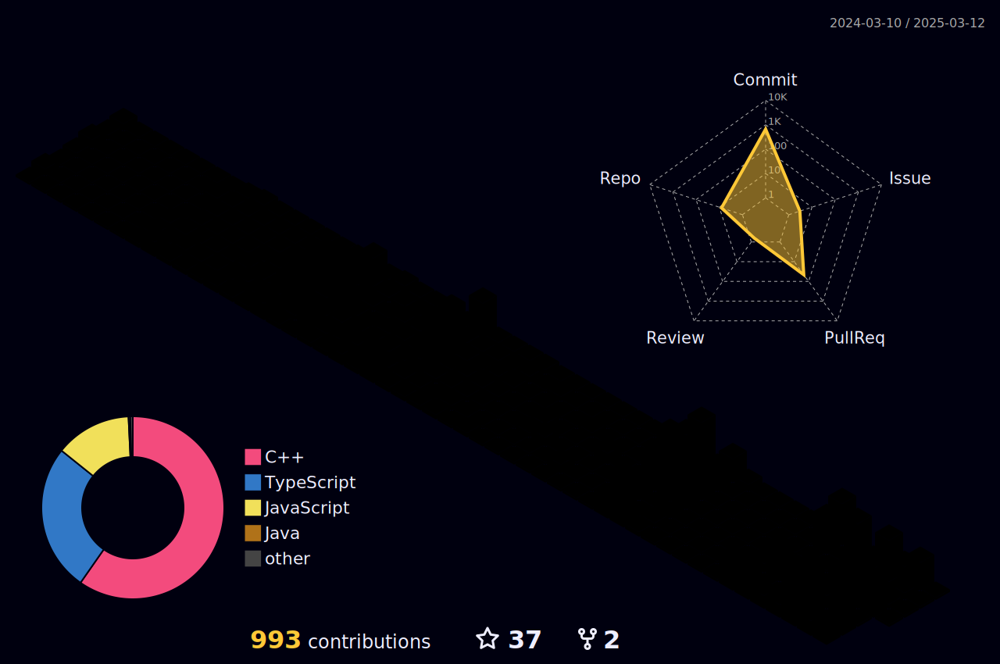

## **
Hey 👋, I'm Ebrahim El-Sayed
**  
  

  

  
  

### 
 Glad to see you here!  

 A mildly intelligent guy who codes, I am a backend developer.

studying computer engineering at faculty of engineering Mansoura university.
I am a Coding lover and very curious about learning new things.
  
  

   

  <a href=""></a>

   
## 
 Rapidfire  
<table><tr><td valign="top" width="50%">

- 
🌱 I’m currently learning backend development
  
  

- ❓ Ask me about anything related to backend stack and related technologies  

</td><td valign="top" width="50%">

  

</td></tr></table>  

   

   

  

  

   

 

----

