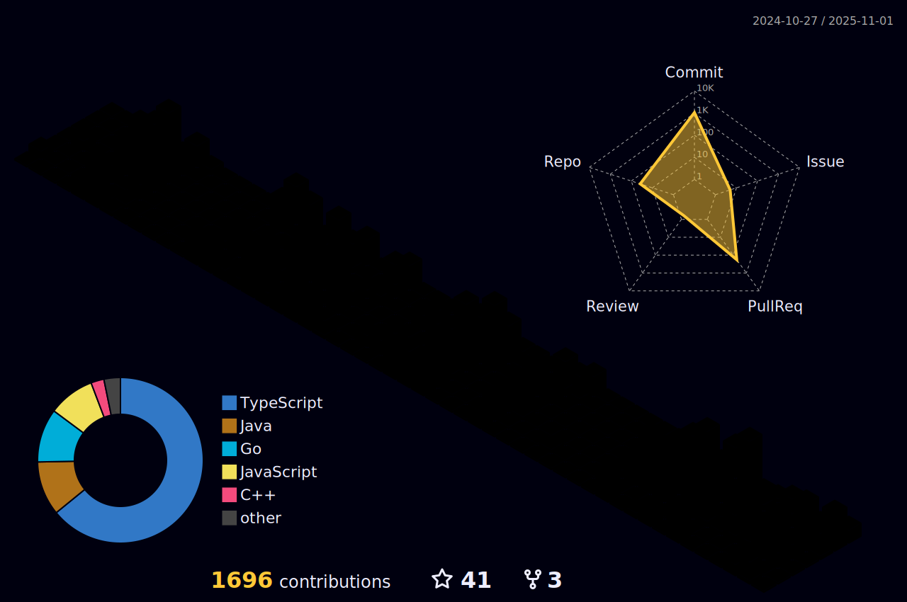

## **
Hey 👋, I'm Ebrahim El-Sayed
**  
  

  

  
  

### 
 Glad to see you here!  

 A mildly intelligent guy who codes, I am a backend developer.

studying computer engineering at faculty of engineering Mansoura university.
I am a Coding lover and very curious about learning new things.
  
  

   

  <a href=""></a>

   
  

  ## Technology Stack: 
<a href=""></a>
 
<a href=""></a>

   

  

<a href=""></a>

  <a href=""></a>

   

 

----

